# GeoKad — Geo-Distributed Kademlia for Emergency Mesh Networks

> **A hybrid P2P emergency response system** combining geo-clustered Kademlia DHT, BLE mesh networking, drone swarm coordination, and AI anomaly detection — built for tourists and first responders in connectivity-challenged environments.

---

## What is GeoKad?

GeoKad is the core distributed routing protocol powering **TourSafe**: a decentralized safety platform for tourists in remote areas. It takes the standard Kademlia DHT algorithm and extends it with GPS-derived node IDs, aligning the XOR keyspace with physical space. The result: nodes that are geographically close are also close in keyspace, making routing naturally locality-aware without any central coordination.

The system runs across two environments:
- **Mobile (TourSafe App)** — React Native app using BLE mesh for phone-to-phone SOS propagation
- **Drone Swarm** — ROS + Gazebo simulation where drones self-organize using 3D geohash IDs and route mission-critical messages in O(log N) hops

---

## Screenshots

<table>
<tr>
<td>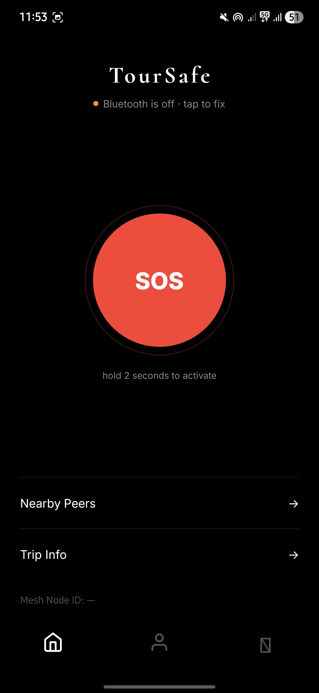<br/><sub>TourSafe — BLE Mesh Active</sub></td>
<td>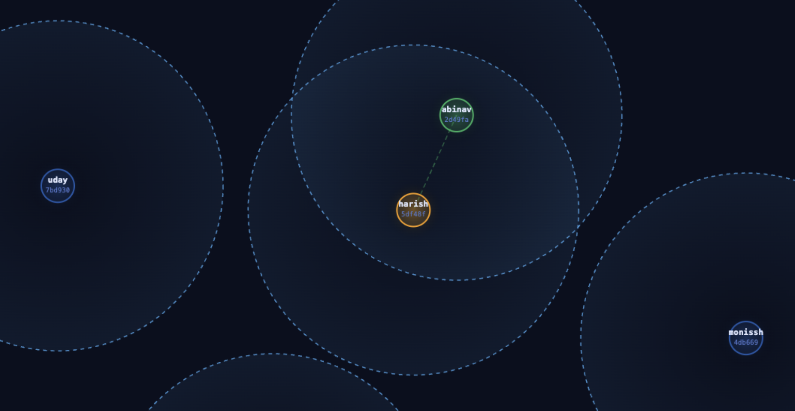<br/><sub>SOS Active — Alerting Peers</sub></td>
<td>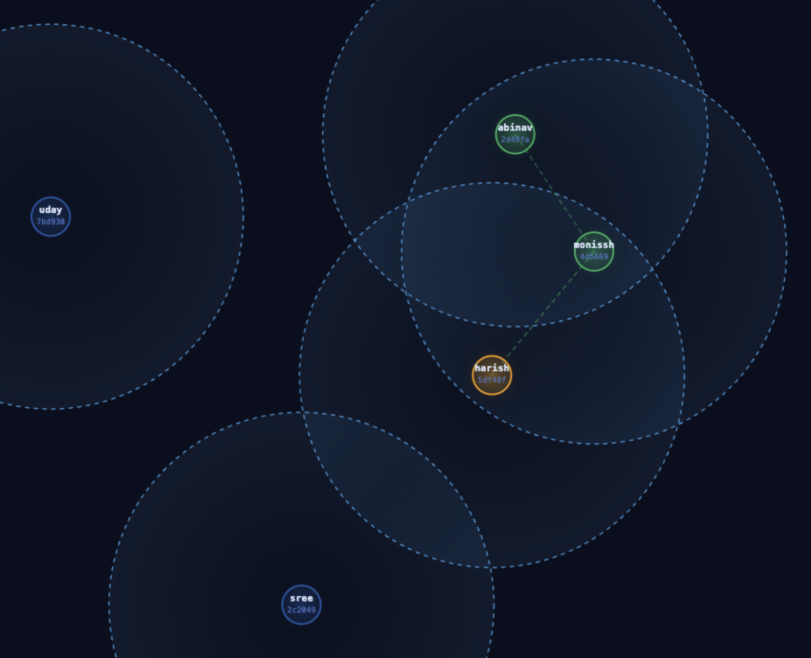<br/><sub>SOS Received on Peer Device</sub></td>
</tr>
<tr>
<td>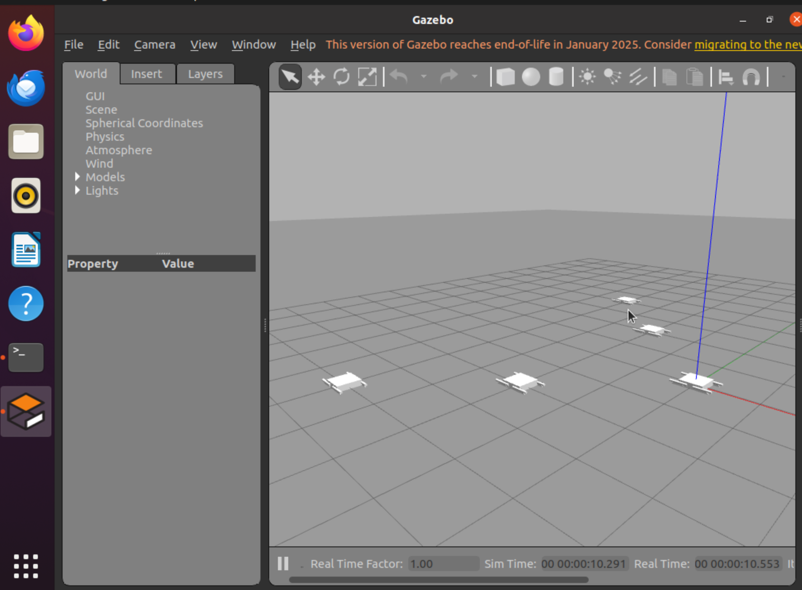<br/><sub>Drone Swarm in Gazebo 11</sub></td>
<td>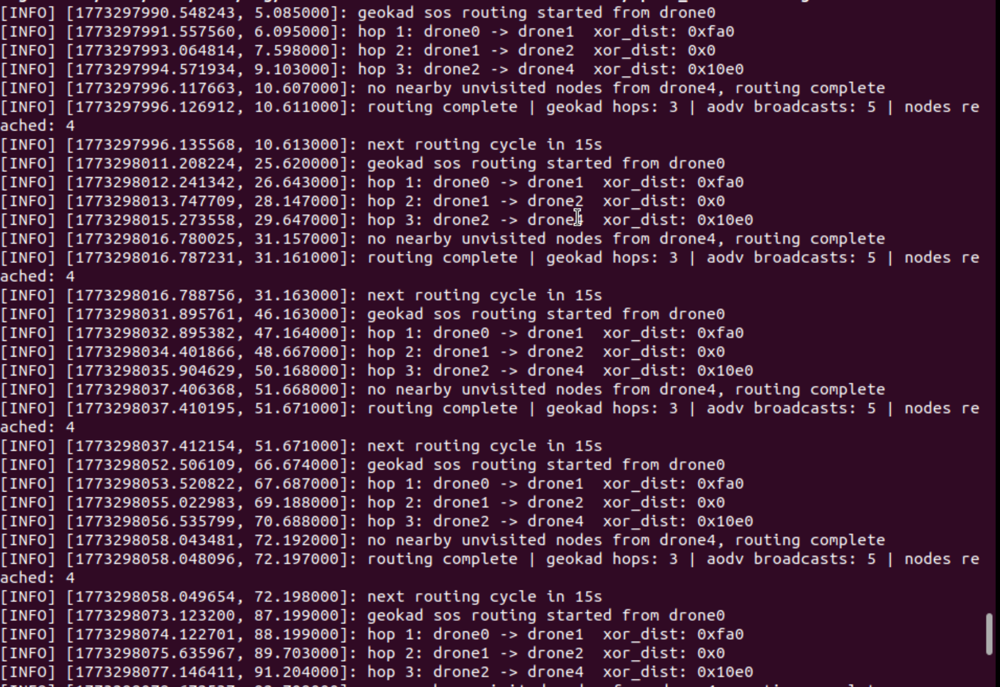<br/><sub>GeoKad Routing Logs — Live Terminal</sub></td>
<td>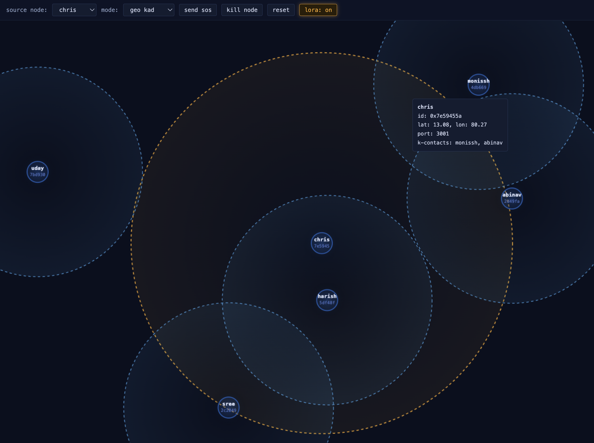<br/><sub>LoRa + ESP32 Hardware PoC</sub></td>
</tr>
</table>

---

## How Kademlia Works (the foundation)

Standard Kademlia (used in BitTorrent, IPFS) gives every node a random ID and uses XOR as a distance metric. Two node IDs XOR'd together gives a number — the smaller, the "closer" in keyspace. Each node maintains **k-buckets**: small tables of known contacts, organised by XOR distance.

When routing a message to a target, you don't broadcast — you forward to whichever neighbour in your k-bucket has the **smallest XOR distance** to the target. Each hop gets strictly closer. For N nodes, you reach the destination in **O(log N) hops**.

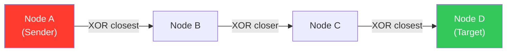

---

## The GeoKad Twist: GPS → Node ID

Standard Kademlia assigns **random IDs** — physically nearby nodes could be XOR-far apart. GeoKad fixes this by **deriving the node ID from GPS coordinates via geohash**.

A geohash converts `(lat, lon)` into a hex string that preserves spatial locality — two physically nearby points produce similar geohash strings → similar node IDs → small XOR distances. **This aligns the XOR keyspace with real physical space.**

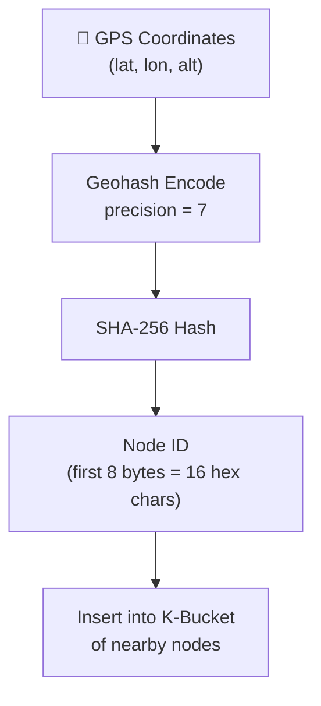

> **Key insight:** Two drones/phones at similar locations → similar geohashes → similar node IDs → small XOR distance → they end up in each other's k-buckets **automatically**, with zero manual configuration.

---

## System Architecture

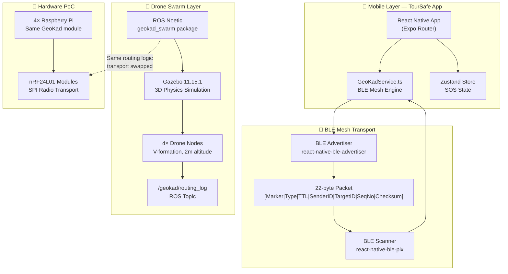

---

## SOS Signal Flow — Phone-to-Phone BLE Mesh

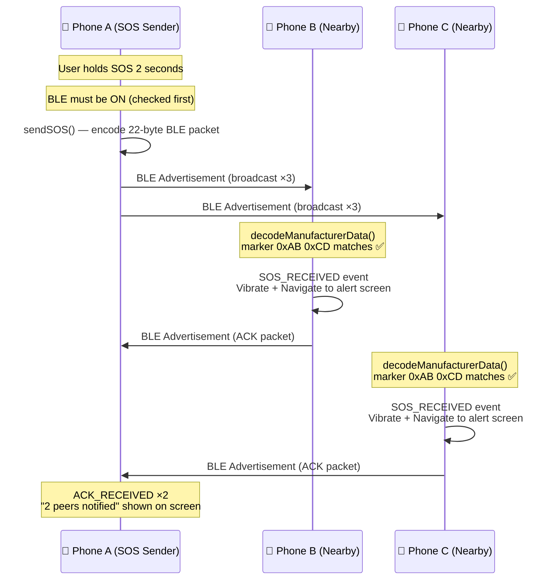

### BLE Packet Layout (22 bytes, fits within 31-byte BLE limit)

```
Byte  0    : 0xAB  ← TourSafe marker 1
Byte  1    : 0xCD  ← TourSafe marker 2
Byte  2    : type  ← 0x01 = SOS, 0x02 = ACK
Byte  3    : TTL   ← hop limit (default 5)
Bytes 4-11 : senderID  (8 bytes, derived from geohash)
Bytes 12-19: targetID  (8 bytes, 0xFF×8 = broadcast)
Byte  20   : seqNo  ← deduplication
Byte  21   : XOR checksum of bytes 0–20
```

> **Why no service UUID in the advertisement?**  
> A 128-bit UUID takes 18 bytes. Our 22-byte payload + 4-byte manufacturer header + 18-byte UUID = **44 bytes — over the 31-byte limit**. Android silently drops oversized packets. We identify TourSafe packets by the `0xAB 0xCD` marker bytes instead.

---

## Drone Swarm — GeoKad in 3D

For the drone swarm, geohash includes **altitude** `(lat, lon, alt)` — giving a **3D keyspace**. Drones flying at similar heights and positions end up in each other's k-buckets naturally.

```mermaid
flowchart TD
    subgraph Drone0["🚁 Drone 0 (SOS Origin)"]
        D0_GPS["Position: x=0, y=0, z=2m"]
        D0_ID["NodeID from geohash3D"]
        D0_KB["K-Bucket: [D1, D2, D3, D4]"]
        D0_GPS --> D0_ID --> D0_KB
    end

    subgraph Routing["GeoKad Routing Engine"]
        XOR["Compute XOR distance\nto each k-bucket contact"]
        NEXT["Forward to min-XOR neighbour"]
        XOR --> NEXT
    end

    subgraph Drones["Other Drones"]
        D1["🚁 Drone 1\nXOR dist: 0xfa0"]
        D2["🚁 Drone 2\nXOR dist: 0x3c1"]
        D3["🚁 Drone 3\nXOR dist: 0x8b2"]
        D4["🚁 Drone 4\nXOR dist: 0x12f ← closest"]
    end

    D0_KB --> XOR
    NEXT --> D4
    D4 -->|"repeat lookup"| D1
    D4 -->|"repeat lookup"| D2
    D4 -->|"repeat lookup"| D3

    style D4 fill:#34C759,color:#fff
    style Drone0 fill:#1a1a2e
```

### What the Simulation Does

The `geokad_swarm` ROS package contains a Python node for each drone. Every **15 seconds** each node:

1. Reads its current position from Gazebo `(x, y, z)`
2. Converts coordinates → geohash hex string → **NodeID**
3. Builds a k-bucket from all other drones' NodeIDs via XOR distances
4. When SOS/waypoint triggered from **Drone 0**, looks up k-bucket → forwards to min-XOR neighbour
5. Each forwarding drone repeats the lookup — terminates when XOR distance can't be reduced

The terminal output (`drone0 → drone1 · XOR dist: 0xfa0`) is live output from `/geokad/routing_log`. **3 hops consistently reach all 4 other drones**, vs. AODV's 5 separate broadcast packets.

### Simulation Stack

| Component | Detail |
|-----------|--------|
| OS | Ubuntu 20.04 |
| ROS | Noetic |
| Simulator | Gazebo 11.15.1 |
| Formation | V-formation, 4 drones, 2m altitude |
| RF abstraction | ROS topics (simulation) / nRF24L01 SPI (hardware) |
| Routing refresh | Every 15 seconds (simulates real drone movement) |

### Hardware PoC

The same GeoKad Python module runs on **4 × Raspberry Pi** boards connected via **nRF24L01 radio modules**. The only change: transport layer swaps from ROS topic passing → SPI radio calls. Routing logic is identical.

---

## Mobile App Architecture

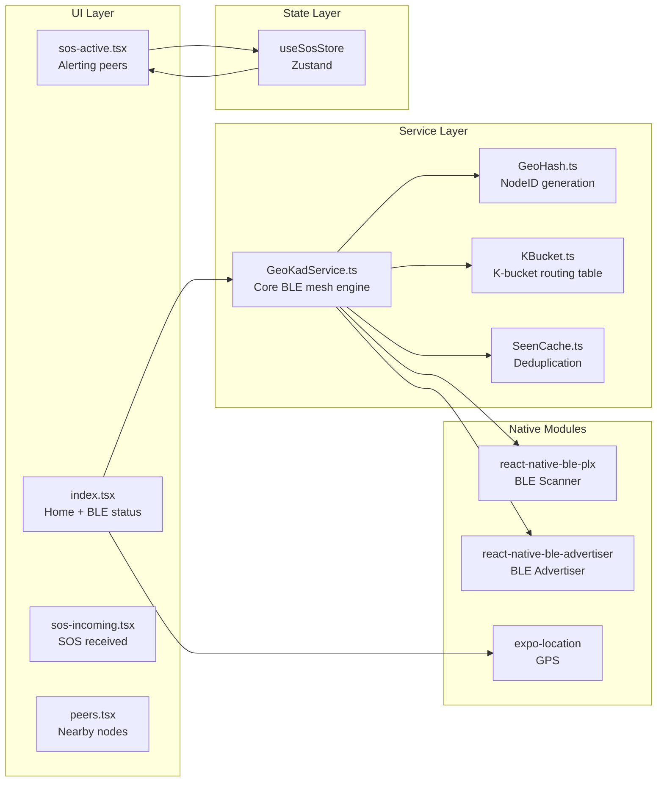

### Key Design Decisions

| Decision | Rationale |
|----------|-----------|
| No service UUID in BLE advertisement | 128-bit UUID = 18 bytes → blows 31-byte BLE packet limit. Identification done via `0xAB 0xCD` marker |
| `onStateChange` only (no `bleManager.state()`) | `state()` returns `'Unknown'` immediately after BleManager creation on Samsung — causes false "BT off" |
| Advertiser failure is non-fatal | If advertiser can't load, device still scans and receives SOS; mesh degrades gracefully |
| `SCAN_MODE_LOW_LATENCY` | Emergency app — discovery speed beats battery conservation |
| Broadcast SOS × 3 (0ms, 500ms, 1200ms) | BLE packets can be silently dropped; redundant sends improve reliability |
| ACK dedup (3s window) | Prevents rapid-fire duplicate ACKs from relay nodes flooding the mesh |

---

## Repository Structure

```
geokad/
├── apps/
│   └── mobile/                  # TourSafe React Native app (Expo)
│       ├── app/
│       │   ├── (tabs)/
│       │   │   ├── index.tsx    # Home screen — BLE init, SOS trigger
│       │   │   └── peers.tsx    # Nearby peers list
│       │   ├── sos-active.tsx   # SOS broadcasting screen
│       │   └── sos-incoming.tsx # SOS received alert screen
│       ├── components/
│       │   └── SOSButton.tsx    # 2-second hold SOS button
│       ├── services/
│       │   ├── GeoKadService.ts # Core BLE mesh engine
│       │   ├── GeoHash.ts       # GPS → NodeID via geohash + SHA-256
│       │   ├── KBucket.ts       # Kademlia k-bucket routing table
│       │   └── SeenCache.ts     # Packet deduplication
│       └── store/
│           └── useSosStore.ts   # Zustand state (SOS active, peer count)
├── simulations/
│   └── geokad-visualizer.html   # Interactive GeoKad routing visualizer
├── docs/
│   └── mid_sem_review_pics/     # Screenshots and demo photos
└── packages/                    # Shared packages (monorepo)
```

---

## Tech Stack

### 📱 Mobile App (TourSafe)

| Layer | Technology | Purpose |
|-------|-----------|---------|
| Framework | React Native 0.81 + Expo SDK 54 | Cross-platform mobile |
| Routing | Expo Router 6 | File-based navigation |
| Language | TypeScript | Type safety |
| BLE Scanning | `react-native-ble-plx` 3.4 | Scan for BLE advertisements |
| BLE Advertising | `react-native-ble-advertiser` 0.0.17 | Broadcast SOS/ACK packets |
| State Management | Zustand 5 | SOS active state, peer count |
| Location | `expo-location` | GPS coordinates for NodeID |
| Hashing | `expo-crypto` (SHA-256) | NodeID derivation from geohash |
| Geohash | `ngeohash` | GPS → spatial hash string |
| Animations | React Native Reanimated 3 | SOS pulse animations |
| Fonts | `@expo-google-fonts/inter`, `cormorant` | Typography |
| Build | EAS Build (local) | APK generation |

### 🚁 Drone Swarm

| Layer | Technology | Purpose |
|-------|-----------|---------|
| OS | Ubuntu 20.04 | Simulation host |
| Middleware | ROS Noetic | Drone communication bus |
| Simulator | Gazebo 11.15.1 | 3D physics + drone spawning |
| Language | Python 3 | GeoKad routing node |
| Routing protocol | GeoKad (custom Kademlia) | O(log N) geo-aware routing |
| Radio (simulation) | ROS Topics | Abstracted RF link |
| Radio (hardware PoC) | nRF24L01 over SPI | Real RF communication |
| Hardware (PoC) | Raspberry Pi 4 × 4 | Physical node hardware |
| Geohash (3D) | Custom `(lat, lon, alt)` encoder | 3D keyspace for altitude awareness |

### 🔧 Wearable / Sensor Layer

| Layer | Technology | Purpose |
|-------|-----------|---------|
| MCU | ESP32 | Sensor fusion + LoRa gateway |
| IMU | MPU-6050 | Fall detection |
| PPG | MAX30102 | Heart rate anomaly detection |
| Long-range radio | SX1276 LoRa (868/915 MHz) | 2–5 km device-to-device range |
| AI Model | LSTM (TensorFlow Lite) | Trajectory anomaly detection |

---

## Getting Started

### Mobile App

```bash
# Install dependencies
cd apps/mobile && npm install

# Build APK (local)
eas build --platform android --profile preview --local

# Install on connected device
adb install -r build-<timestamp>.apk

# Watch logs
adb logcat | grep -E "TourSafe|ReactNativeJS"
```

### Drone Simulation

```bash
# ROS Noetic + Gazebo 11 required (Ubuntu 20.04)
roslaunch geokad_swarm geokad_swarm.launch

# Watch routing logs
rostopic echo /geokad/routing_log
```

---

## Why It Matters — Numbers

| Metric | Traditional Systems | GeoKad / TourSafe |
|--------|--------------------|--------------------|
| Alert propagation time | 15–20 minutes | **2–3 seconds** |
| Internet required | Yes | **No** |
| SOS range (per hop) | N/A offline | **~100m (BLE)** |
| Drone routing hops | 5 broadcasts (AODV) | **3 hops (GeoKad)** |
| Routing complexity | O(N) broadcast | **O(log N)** |
| Single point of failure | Yes (server) | **No — fully P2P** |

---

## Built By — Team 26

| Name | Roll Number |
|------|-------------|
| R Abinav | ME23B1004 |
| Harish Kumar | EC23B1017 |
| Uday Y | EC23B1007 |
| Chris Jason | CS23B1012 |
| Sree Balaji | EC23B1041 |
| Monissh Balaji | EC23B1040 |